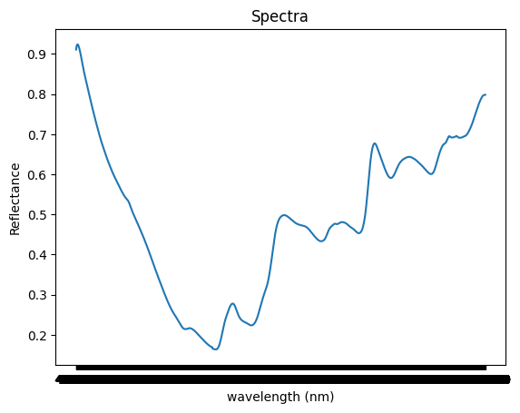
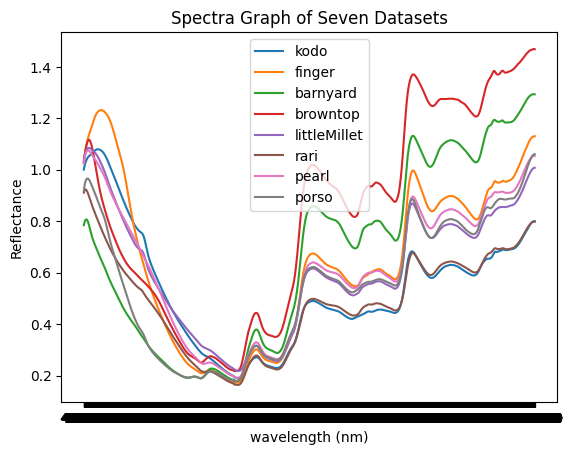

# Millet Spectral Data Visualization

This project reads spectral reflectance data for different millet varieties from multiple Excel files and plots their reflectance spectra over a wavelength range. It helps in visualizing and comparing spectral signatures of various millet types.

---

## Features
- Reads spectral reflectance data from Excel files.
- Cleans and renames dataset columns for easy processing.
- Plots individual spectral curves for each millet variety.
- Overlays multiple datasets for comparative visualization.
- Zooms into specific wavelength ranges (e.g., 900–1700 nm).

---

## Datasets Used
The following datasets (Excel format) are required:
1. `kodo_millet_jk-41 (1).xls`
2. `Finger_Millet (1).xls`
3. `Barnyard.xlsx`
4. `Browntop.xls`
5. `Little Millet DHLM-36-3 (1).xls`
6. `millets_RARI.xls`
7. `Pearl MilletPusa1801 (1).xls`
8. `Porso-Millet_tnau (2).xls`

> **Note:** All datasets should have wavelength in the first column and reflectance values in the subsequent columns.

---

## Example Plots

### Individual Plot Example

### Combined Plot Example

---
